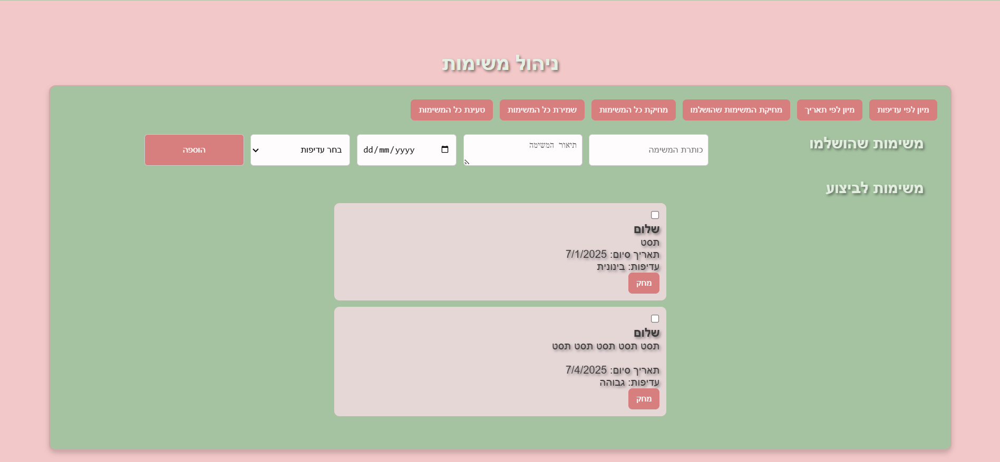

# ✅ List Tod0

**List Tod0** is a simple, user-friendly to-do list web app that helps you organize your tasks efficiently. Add, mark complete, and delete tasks to keep your day on track with ease.

🌐 [Visit the site](https://list-tod0.netlify.app)

---

## ✨ Features

- 📝 Add tasks quickly to your to-do list  
- ✔️ Mark tasks as completed  
- ❌ Delete tasks you no longer need  
- 🧹 Clean, minimalistic design for focused productivity  
- ⚡ Fast loading with Netlify hosting  

---

## 🚀 Getting Started

To run the project locally:

git clone https://github.com/yourusername/list-tod0.git
cd list-tod0
npm install
npm start

---

## 🛠️ Technologies Used

- **Frontend:**  HTML5, CSS3, JavaScript  
- **Hosting:** Netlify  

---

## 📌 Roadmap & Future Ideas

- ⏰ Add scheduling and reminders  
- 📊 Include task filtering and categorization  
- 📱 Improve mobile responsiveness and UX  
- 🔗 Sync tasks with calendar or other apps  

---

## 📜 License

This project is open source — feel free to fork, modify, and contribute.

---
